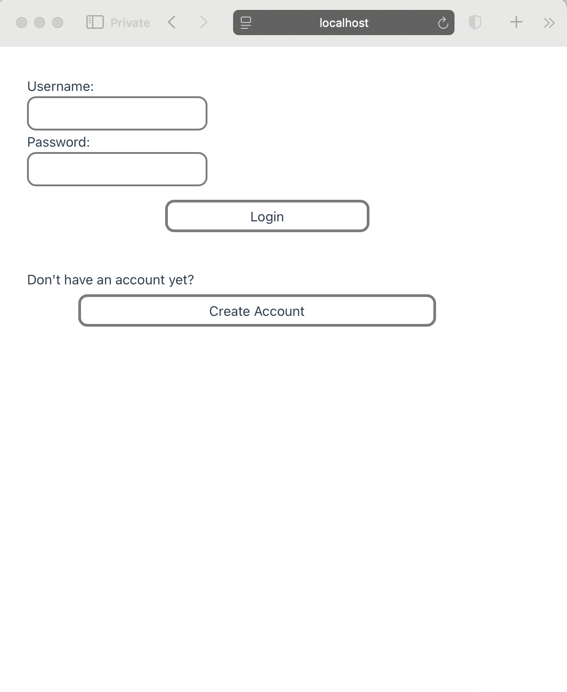
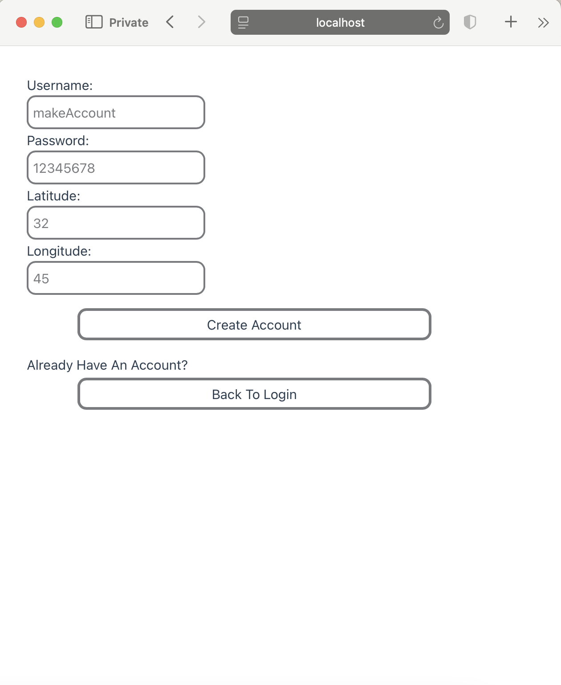
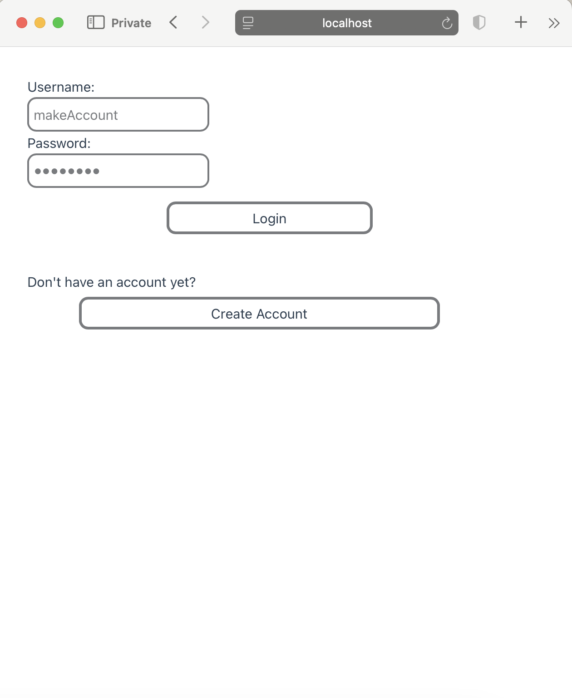
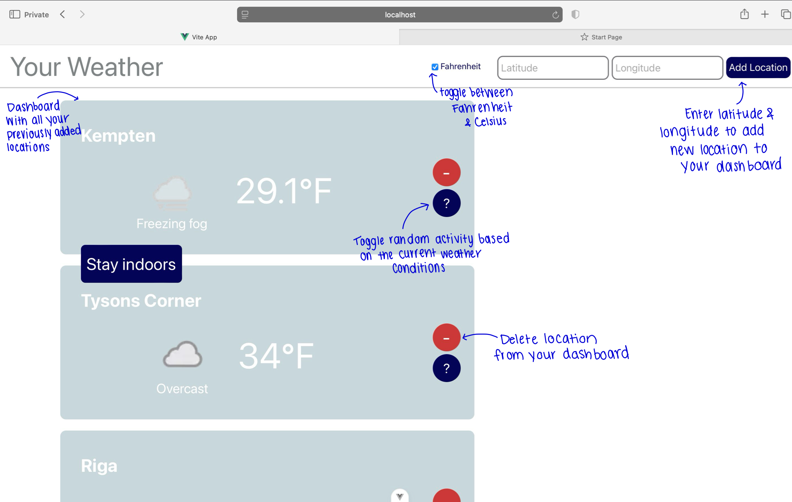

This web application is a microservice-based full-stack weather application built using Spring Boot for the backend and Vue.js for the frontend. 
In its development, I placed particular emphasis on learning backend frameworks and tools like: Eureka, Jenkins, Maven, API Gateway, etc. Therefore, it is more of an app skeleton that focuses on the connection of different components.

## How to Use

Upon opening the web application you will be directed to a welcome page.

First time users will click, "create account" and redirected to the create account page

After creating an account, or returning users will be brought back to the welcome page, where they can enter their login information

If your login credentials are valid, you will be redirected to the main page:

## Components
For Service Registry and Service Discovery of the microservices, I added a Eureka Server. This addition, for example, allows 
communication between the user-service and weather-service microservices. This is relevant since each user has saved locations for which 
the weather must be fetched. The weather data is fetched from a public weather API (https://api.weatherapi.com/v1/current.json) and is 
updated each time a user's web page is refreshed. 

After developing the backend, I added a frontend which takes the backend endpoints and displays the corresponding data using Vue.js.

## Prerequisites
In order to run the project on your own device. Clone the repository in an IDE of your choice. You must have npm and node installed. Then,
follow these steps:

To start the backend:
Within each microservice: weather-service, user-service, 
gateway-api, and the eureka-server using the following command:
./mvnw spring-boot:run

Then can view all the microservices running on the Eureka server at: 

http://localhost:8761

Then, to start the frontend, just run in the frontend/weather-app-frontend directory:

npm run dev 

The web app's url will appear in the terminal.

Backend endpoints: localhost:9191/